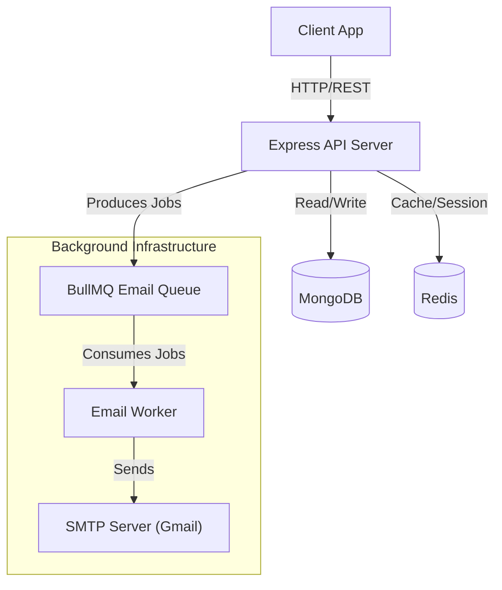

# Enterprise Multi-Factor Authentication (MFA) API


A production-ready, highly secure authentication system built with Node.js and Express. This project implements advanced security features including Two-Factor Authentication (TOTP), Redis-Backed Session Management, Asynchronous Email Processing, and Device Fingerprinting.

---

## Key Features

**Security & Authentication**
*   **Two-Factor Authentication**: Time-based One-Time Password (TOTP) implementation with QR code generation.
*   **Adaptive MFA**: Intelligent login flow that skips 2FA for known/trusted devices to improve user experience.
*   **Redis Session Management**: Secure, high-performance session handling backed by Redis.
*   **Device Fingerprinting**: Tracks user devices and alerts on suspicious or new device logins.
*   **Secure Password Resets**: Time-limited, token-based password reset flows.
*   **Brute-Force Protection**: Dedicated rate limiters for login endpoints.

**Performance & Infrastructure**
*   **Redis Message Queue**: Asynchronous background processing for emails using BullMQ.
*   **Rate Limiting**: Granular rate limiting based on routes and IP addresses.
*   **Layered Architecture**: Clean separation of concerns (Controllers, Services, Repositories).
*   **Centralized Error Handling**: Standardized error responses across the API.

---

## Architecture

This project uses a layered architecture with an asynchronous message queue to ensure high availability and responsiveness.



---

## Tech Stack

*   **Runtime**: Node.js v18+
*   **Framework**: Express.js 5.0
*   **Database**: MongoDB (Mongoose)
*   **Caching & Queue**: Redis (Session Store & Message Queue)
*   **Authentication**: Passport.js, JWT, Speakeasy (TOTP)
*   **Validation**: Zod
*   **Security**: Helmet, CORS, Bcrypt, Express-Rate-Limit

---

## Prerequisites

Ensure the following dependencies are installed in your environment:

*   **Node.js**: v18 or higher
*   **MongoDB**: Local instance or Atlas connection string
*   **Redis**: Required for both session management and background job queues

---

## Installation & Setup

### 1. Clone & Install
```bash
git clone https://github.com/Iamahmedforreal/Multi-Factor-Authentication-in-express.js.git
cd "Multi Factor Authentication"
npm install
```

### 2. Configure Environment
Create a `.env` file in the root directory. Configure the following variables:

```env
# Application Configuration
NODE_ENV=development
PORT=7000
BASE_URL=http://localhost:7000

# Database Configuration
MONGODB_URI=mongodb://127.0.0.1:27017/mfa-auth

# Redis Configuration (Mandatory)
REDIS_HOST=127.0.0.1
REDIS_PORT=6379
# REDIS_PASSWORD=your_redis_password (optional)

# Security Secrets (Use strong, random strings)
JWT_SECRET=your_super_secure_access_secret
JWT_REFRESH_SECRET=your_super_secure_refresh_secret
JWT_TEMPOROY=your_super_secure_temp_secret

# Email Service Configuration
EMAIL_USER=your-email@gmail.com
EMAIL_PASS=your-app-specific-password
```

> [!IMPORTANT]
> If using Gmail, you must generate an App Password. Do not use your regular account password.

### 3. Start Infrastructure
Ensure your backing services are running:
```bash
# Start Redis
redis-server

# Start MongoDB
mongod
```

### 4. Run the Application
```bash
# Development Mode (enables hot-reload)
npm run dev

# Production Mode
npm start
```
The server will initialize on `http://localhost:7000`.

---

## 🐳 Running with Docker (Recommended)

Run the entire application (App + Redis + MongoDB) with a single command:

```bash
docker-compose up --build
```
*   **API**: `http://localhost:7000`
*   **Redis**: `localhost:6379`
*   **MongoDB**: `localhost:27017`

---

## Project Structure

```
├── config/             # Configuration for Database, Redis, and Passport
├── controller/         # Request handlers and input parsing
├── middleware/         # Authentication, validation, and logging middleware
├── models/             # Mongoose data models
├── route/              # API Route definitions
├── services/           # Business logic layer
│   ├── authService.js    # Core authentication logic
│   ├── emailService.js   # Message queue producer
│   └── sessionService.js # Refresh token management
├── utils/              # Utility functions
├── validators/         # Zod validation schemas
├── workers/            # Background workers
│   └── emailWorker.js    # Message queue consumer
└── server.js           # Application entry point
```

---

## Authentication Flow

### Standard Login
1.  User submits credentials via `POST /login`.
2.  Server validates password and checks 2FA status.
3.  **If 2FA is Disabled**: Returns `accessToken` and sets `refreshToken` cookie.
4.  **Device Check**: If the device is unrecognized, a "New Device Alert" email is queued.

### 2FA Login (Adaptive)
1.  User submits credentials via `POST /login`.
2.  Server checks if 2FA is enabled **AND** if the device is unrecognized.
3.  **Known Device**: Verification is **SKIPPED**; user logged in immediately.
4.  **New Device**: Server returns a temporary `tempToken`.
5.  User submits TOTP code `POST /2fa/verify`.
6.  Server validates code, returns tokens, and **trusts the device** for future logins.

### Asynchronous Emailing
1.  User actions (e.g., Register, Reset Password) trigger the `EmailService`.
2.  The service pushes a job to the `email-queue` in Redis.
3.  The API responds immediately to the client to ensure low latency.
4.  The `EmailWorker` consumes the job and sends the email in the background.

---

## API Reference

### Authentication
*   **POST** `/api/auth/register` - Register a new account
*   **POST** `/api/auth/login` - Authenticate user
*   **POST** `/api/auth/logout` - Terminate session
*   **GET**  `/api/auth/refresh` - Rotate access token
*   **GET**  `/api/auth/verify-email` - Verify email address

### Multi-Factor Authentication
*   **POST** `/api/auth/2fa/setup` - Initialize 2FA setup
*   **POST** `/api/auth/2fa/verify` - Verify TOTP code
*   **POST** `/api/auth/2fa/reset` - Disable 2FA

### Account Management
*   **POST** `/api/auth/forgot-password` - Request password reset
*   **POST** `/api/auth/reset-password` - Reset password
*   **GET**  `/api/auth/status` - Retrieve account status

---

## Security Standards

*   **Password Storage**: Bcrypt hashing with salt rounds.
*   **Session Security**: HttpOnly cookies to prevent XSS attacks.
*   **Concurrency**: Atomic MongoDB operations for accurate rate limiting.
*   **Data Integrity**: Strict input sanitization and validation.
*   **Audit Logging**: Comprehensive logging of security-critical events.

---

## License

This project is licensed under the ISC License.

---

**Developed by Ahmed**
[GitHub Profile](https://github.com/Iamahmedforreal)
